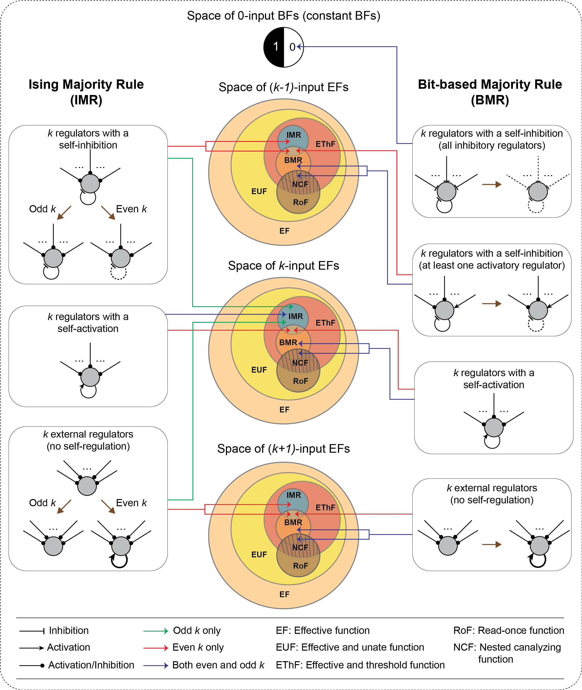

# TMRvsBioLogic
This repository is associated with the manuscript: "Simple threshold-based Boolean rules fall short in capturing biological regulatory network dynamics".
## Contributor
- Priyotosh Sil

This repository contains 6 folders which are described below.

### 1. computational 
This folder contains the IMRs and BMRs corresponding to each sign combination. It also includes a list of one representative from each equivalence class of NCFs.

### 2. TMR_to_BF
This folder contains code for mapping TMRs (IMRs or Ising Majority Rules and BMRs or BMR Majority Rules) to the corresponding EFs (TMR_to_BF.ipynb).

### 3. Enrichment_analysis
This folder is associated with the enrichment analysis of TMRs in the three empirical datasets (BBM, MCBF and Harris)
- input: This folder contains the counts and theoretical fractions of different subtypes of TMRs within EThF (Expected_fraction_data_EF.tsv). The Empirical_dataset folder includes all three reference datasets used in our analysis. These files provide information about which classes each BF falls into.
- src: This folder contains code for performing enrichment analysis and generating plots.
- output: This folder contains the empirical fractions of various subtypes in the datasets.

### 4. Complexity_analysis
This folder is associated with the computation of the averaged Boolean complexity and averaged sensitivity of TMRs and NCFs.
- input: Contains the Boolean complexity and average sensitivity data for TMRs and NCFs.
- src: Contains the code to compute and generate the plots of averaged Boolean complexity and averaged sensitivity of TMRs and NCFs, as well as to generate the corresponding plots for different sign combinations of the regulators.

### 5. Attractor_and_basin_recovery_of_BBM_models
This folder contains all the required codes and data to compute the attractor recovery score and the Jensen-Shannon (JS) distance between the basin fraction distribution from the corresponding gold standard.
#### a. network_generation
- input: Contains the .bnet files of the 24 selected published models.
- src: Contains the code to extract information from the models.
- output: Contains the extracted information for each model.

#### b. TMR_model_generation
This folder contains code to generate the TMRs corresponding to a published model.

#### c. convert_to_bnet
- input: Contains the rules in integer format corresponding to the published model and TMRs.
- src: Contains code to generate BoolNet files from the integer format.
- output: Contains the BoolNet files corresponding to each type.

#### d. Simulating_published_models_and_TMRs
This folder contains code to compute the attractors of a model and their corresponding basin sizes.

#### e. Calculation_of_att_basin_recov_score
- input: This folder contains information about the attractors and their basin sizes for the published models and their TMR alternatives. It also includes biologically meaningful attractors.
- src: This folder contains the code to compute the attractor recovery score and the JS distance between the basin fraction distributions and the corresponding gold standard, as well as to generate the corresponding heatmaps.
- output: This folder contains .tsv files with the computed scores and the generated heatmap plots.

#### f. models_with_non_NCFs
This folder contains the analysis of the four models that include at least one non-NCF BF. 
- model_generation: This folder contains the code to generate alternative models by replacing non-NCFs with suitable scNCFs.
- attractor_and_JS_basin_score: This folder contains the data for the attractor recovery scores and JS distance scores for each alternative model.

### 6. Stability_analysis_of_RBN_ensembles
This folder contains the code and data required to reproduce the results associated with the analysis of the RBN ensemble in the manuscript.

- RBNs_and_the_models: This folder contains the random networks and the three types of models (scNCF, IMR, and BMR) used in our study.
- derrida_final_hamming_fragility: This folder contains code to compute the stability measures $\delta$, $h^{\infty}$, and $\phi$.
- plot: This folder contains the necessary code and data to generate boxplots showing the distributions of various stability measures. For the code to compute G-density and the average convergence rate of GoE states, please refer to our other GitHub repository: [BushySTG](https://github.com/asamallab/BushySTG/).
